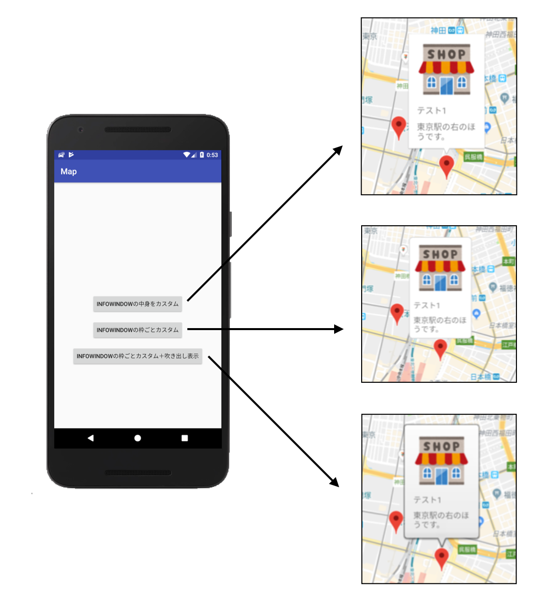

# サンプルアプリのイメージ



# 動かすために
このアプリを動かすには以下の準備が必要です。

## 1. Google Map API Key取得
このProjectはAndroidStudioの[new Project]->[Google Maps Activity]で作成しています。
AndroidManifest.xmlの`meta-data`に`Google Map API Key`を指定してください。

## 2. 地図のMarker情報作成
res/raw/placedata.jsonを作ってください。
```
[
   {"title": "テスト1", "imageUrl":"XXX", "memo":"東京駅の右のほうです。",  "latitude": 35.683040, "longitude": 139.770254},
   {"title": "テスト2", "imageUrl":"XXX", "memo":"美術館の近くです。東京駅の左のほう。",  "latitude": 35.678194, "longitude": 139.763930},
   {"title": "テスト3", "imageUrl":"XXX", "memo":"東京駅の上の方の道です。",  "latitude": 35.685327, "longitude": 139.766804}
]
```
サンプルではGlideを使用しOkHttpClientを使用してリモートからimageを取得しています。
そのためXXXには参照する画像のURLを指定してください。

